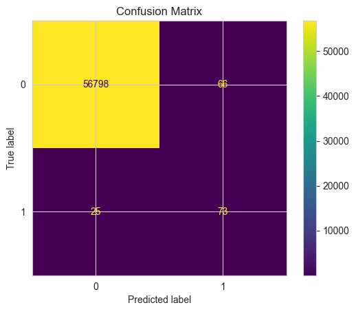
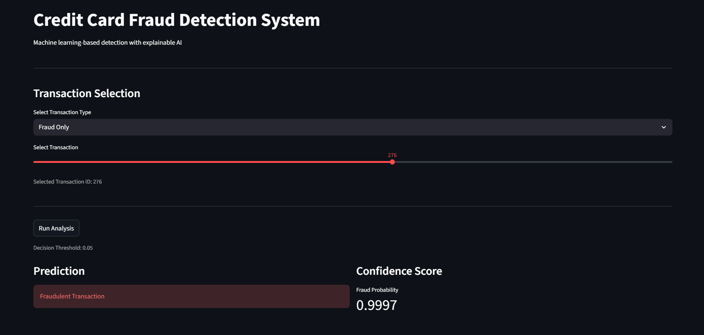
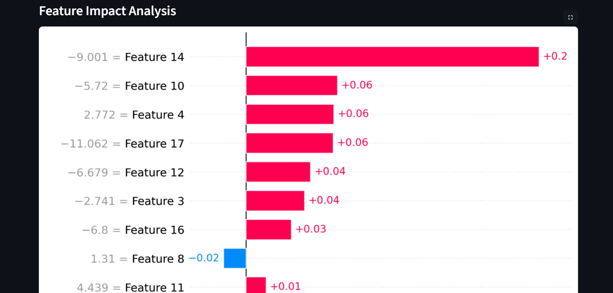
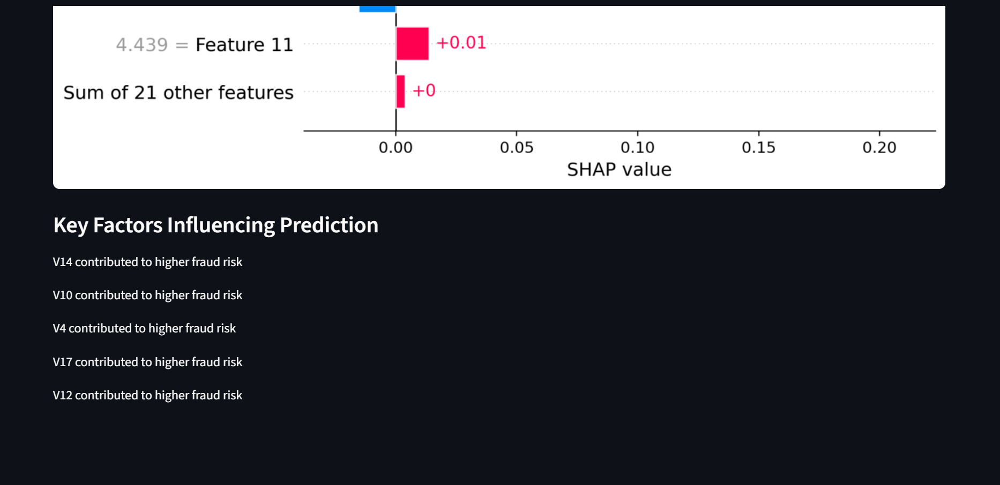
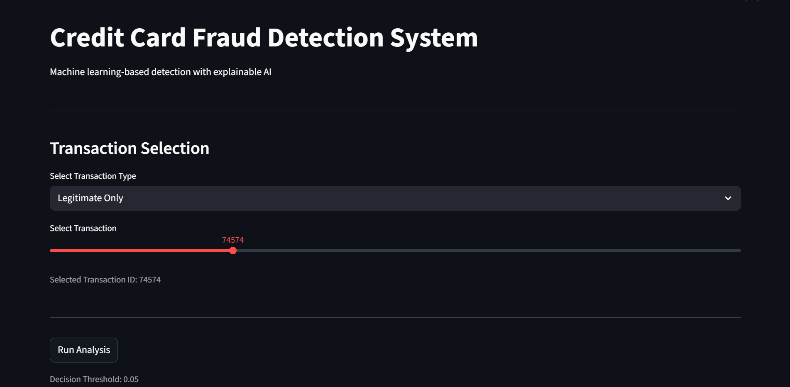
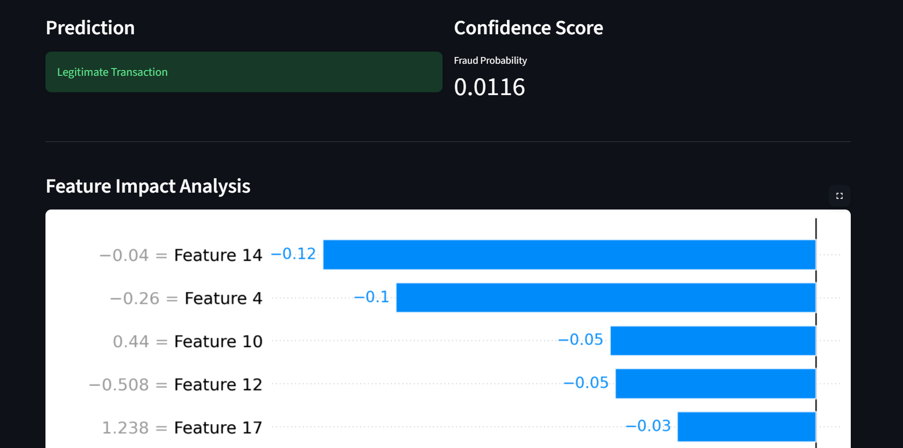
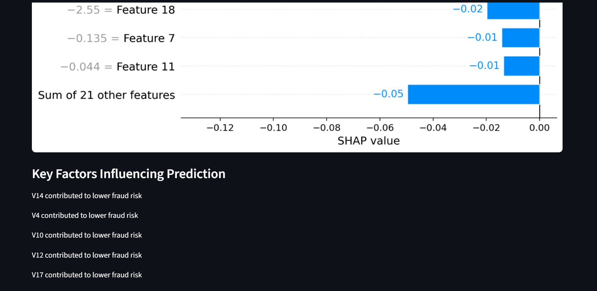

# FraudShield
## AI-Powered Credit Card Fraud Detection System

FraudShield is a machine learning-based system designed to detect fraudulent credit card transactions in real-time. It combines predictive modeling with explainable AI techniques to provide both accurate predictions and transparency in decision-making.
Designed for high-recall fraud detection to minimize financial risk while maintaining interpretability using SHAP.
---

## Features

* Fraud detection using Machine Learning
* Explainable AI using SHAP (feature impact analysis)
* Real-time transaction prediction
* Visualization of key factors influencing fraud detection
* Interactive UI (Streamlit/Flask)

---

## Tech Stack

* Python
* Scikit-learn
* Pandas & NumPy
* SHAP (Explainability)
* Streamlit 

---

## Model Performance

|  Metric   |   Value   |
| --------- | --------- |
| Accuracy  |  99.84%   |
| Precision |  52.52%   |
| Recall    |  74.49%   |
| ROC-AUC   |  97.91%   |

The model prioritizes recall over precision, ensuring that the majority of fraudulent transactions are detected, even at the cost of some false positives.
Due to class imbalance in fraud detection, recall is prioritized to minimize undetected fraudulent transactions.

The model performance was analyzed at different classification thresholds. 
Increasing the threshold improves precision but reduces recall, highlighting 
the trade-off between detecting more frauds and minimizing false alarms.

Threshold Tuning Results:
| Threshold | Precision | Recall |
|----------|----------|--------|
| 0.3      | 11.6%    | 86.7%  |
| 0.5      | 52.5%    | 74.5%  |
| 0.7      | 76.8%    | 64.3%  |
| 0.9      | 95.5%    | 21.4%  |


The confusion matrix shows that the model successfully identifies a large portion of fraudulent transactions, while maintaining a manageable number of false positives.
---
## Handling Class Imbalance

The dataset used for fraud detection is highly imbalanced, with fraudulent transactions representing a very small fraction of the total data.

To address this issue, SMOTE (Synthetic Minority Oversampling Technique) was applied to generate synthetic samples of the minority class (fraud cases). This helped the model learn patterns associated with fraudulent transactions more effectively.

By balancing the dataset, the model achieved improved recall, ensuring that a higher proportion of fraud cases are detected.
---

## Model Behavior Insights
The model prioritizes **recall** to minimize undetected fraudulent transactions.
A trade-off exists between precision and recall, which can be adjusted using classification thresholds.
Higher thresholds reduce false positives but may lead to missed fraud cases.
The use of SMOTE improves the model's ability to detect fraud but may slightly increase false positives.
---

## Explainability

SHAP (SHapley Additive exPlanations) was used to interpret model predictions, identifying key features influencing fraud detection decisions.

## Project Structure

```
FraudShield/
│
├── app/              # UI / Application
├── src/              # Core ML logic
├── models/           # Trained models
├── notebooks/        # EDA & Training
├── data/             # Dataset (ignored in Git)
├── outputs/          # Results
```

---

## Installation & Setup

```bash
git clone https://github.com/alishakulkarni9/FraudShield.git
cd FraudShield
pip install -r requirements.txt
```

---

## Run the Application

```bash
streamlit run app/app.py
```

---

## Screenshots






These visualizations demonstrate not only prediction capability but also model interpretability, which is critical in financial fraud detection systems.
The SHAP-based visualization explains how individual features contribute to the model’s prediction, improving transparency and trust.

---

## Future Improvements

* API integration for real-time transactions
* User authentication system
* Deployment on cloud (Streamlit Cloud / Render)
* Advanced models (XGBoost, Deep Learning)

---

## Author
Alisha Kulkarni
